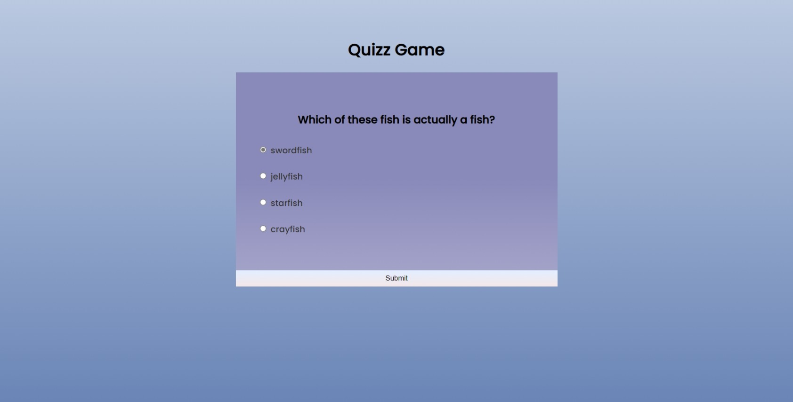
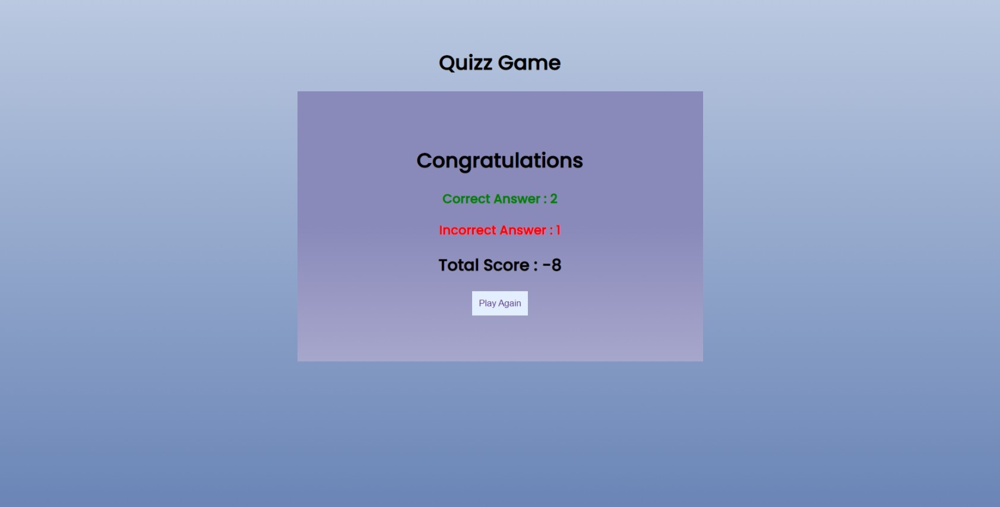

# Quizz-Game ❓
This is a simple website made with HTML, CSS and Javascript which executes it's logic on the client-side.  

   

## Languages  🧰

  

## Screenshots

  

Question page
  

  

Results page

